# Study Guide: Deep-Time6(1).pptx

> [!NOTE]
> Extracted content from presentation. Images are embedded below.

---

## Slide 1

### Original Content

- Life Over Deep TimeSession 6
  - Cephalopods
    - Modern diversity and classification
    - Fossil preservation
    - Nautiloids coiled and straight- Ammonoid growth forms
    - Ammonite shell form and biology, belemnites
  - Echinoderms
    - Classification
    - Biology
    - Echinoderms (urchins)
  - Practical:
  - Target: be able to identify, sketch and label the characteristic morphological characters of a cephalopod.
  - Access primary literature to understand why the theoretical value of Copes Law and the data that supports it.
  - Create and evaluate hypotheses that  account for the accumulation of ammonites in the bed described

### 🎓 讲师讲解

> [AI: Explain Slide 1 - Please analyze the text and visuals above to explain the key concepts of this slide.]

---

## Slide 2

### Original Content

- Learning Outcomes
- Understand the basic biology of cephalopods and echinoderms.
- Apply your understanding to stratigraphic problems
  - Dating rocks in the field using cephalopod sutures
  - Hypotheses testing
  - Harvesting data and concepts from the literature

### 🎓 讲师讲解

> [AI: Explain Slide 2 - Please analyze the text and visuals above to explain the key concepts of this slide.]

---

## Slide 3

### Original Content

- Segments
- Segment 1: Biology and classification of modern cephalopods
- Segment 2: Fossil cephalopods
- Segment 3: Echinoderms

### 🎓 讲师讲解

> [AI: Explain Slide 3 - Please analyze the text and visuals above to explain the key concepts of this slide.]

---

## Slide 4

### Original Content

- Segment 1: Intro to Cephalopoda
- Class Cephalopoda
  - Subclass Nautiloidea
  - Subclass Ammonoidea: (400.0—65.0 Ma)
    - Order Goniatitida (388.5- 252.0 Ma)
    - Order Ceratitida (254.0-200.0 Ma)
    - Order Ammonitida (215.0-66.0 Ma)
  - Subclass Coleoidea (410.0 Ma-Rec)
    - ??Cohort Belemnoidea: Belemnites and kin
  - Superorder Decapodiformes (Squid and Octopods). Won’t discuss much but they do have fossils

### 🎓 讲师讲解

> [AI: Explain Slide 4 - Please analyze the text and visuals above to explain the key concepts of this slide.]

---

## Slide 5

### Visuals

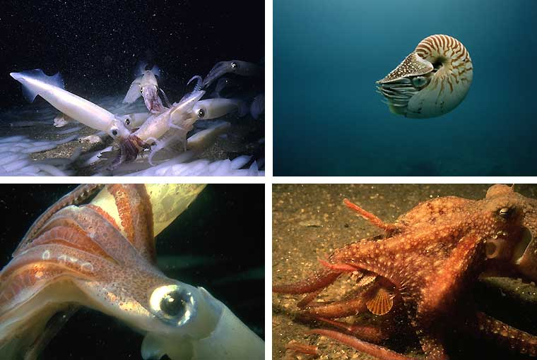

### Original Content

- Phylum Mollusca: Class Cephalopoda

### 🎓 讲师讲解

> [AI: Explain Slide 5 - Please analyze the text and visuals above to explain the key concepts of this slide.]

---

## Slide 6

### Visuals

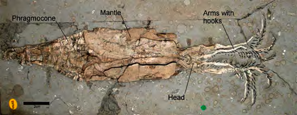

### Original Content

- Exceptionally Preserved Squid(Jurassic Oxford Clay of Wiltshire)

### 🎓 讲师讲解

> [AI: Explain Slide 6 - Please analyze the text and visuals above to explain the key concepts of this slide.]

---

## Slide 7

### Visuals

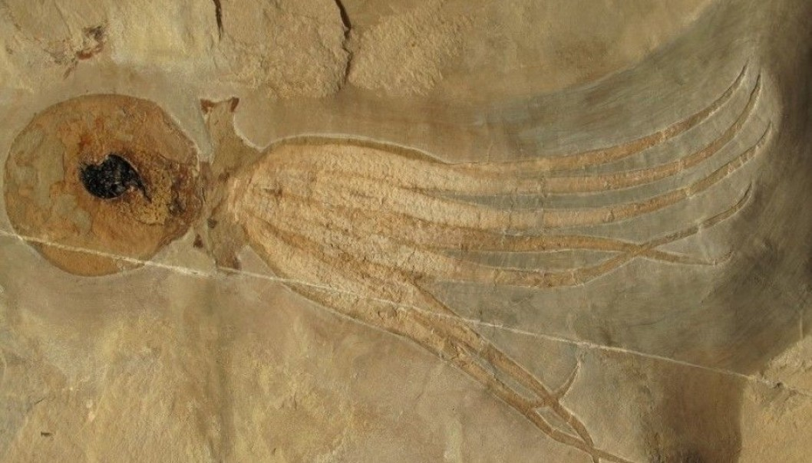

### Original Content

- Exceptionally preserved Octopods

### 🎓 讲师讲解

> [AI: Explain Slide 7 - Please analyze the text and visuals above to explain the key concepts of this slide.]

---

## Slide 8

### Visuals

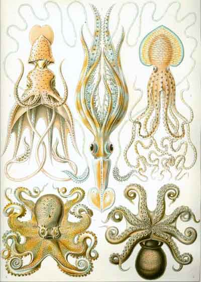

### Original Content

- Modern Cephalopoda

### 🎓 讲师讲解

> [AI: Explain Slide 8 - Please analyze the text and visuals above to explain the key concepts of this slide.]

---

## Slide 9

### Original Content

- Cephalopoda: how advanced?
- Collaborative hunting techniques
- Capable of complex and dexterous movement
- Can communicate via colour change of skin
- Complex optics suggests that their brain has some degree of processing power.

### 🎓 讲师讲解

> [AI: Explain Slide 9 - Please analyze the text and visuals above to explain the key concepts of this slide.]

---

## Slide 10

### Original Content

- Cephalopoda: how advanced?
- Tool use!
- http://www.youtube.com/watch?v=AP_dpbTbess
- Finn, JK, Tregenza, T, and Norman, MD, 2009. Defensive tool use in a coconut-carrying octopusCurrent Biology, Volume 19, Issue 23, 1069-1070
- http://download.cell.com/current-biology/pdf/PIIS0960982209019149.pdf?intermediate=true

### 🎓 讲师讲解

> [AI: Explain Slide 10 - Please analyze the text and visuals above to explain the key concepts of this slide.]

---

## Slide 11

### Original Content

- Cephalopoda: In the blood
- Blood composed of hemocyanin, copper based organic molecule. This is dissolved in the blood and not carried in acell.
- Deoxygenated form is clear, oxygenated form is blue.
- Cephalopod blood greater oxygen carrying capacity than other molluscs.
- Modern cephalopods capable of depleting oxygen reserve in venous blood. Does this imply a limit to the evolution of the cephalopod brain?

### 🎓 讲师讲解

> [AI: Explain Slide 11 - Please analyze the text and visuals above to explain the key concepts of this slide.]

---

## Slide 12

### Visuals

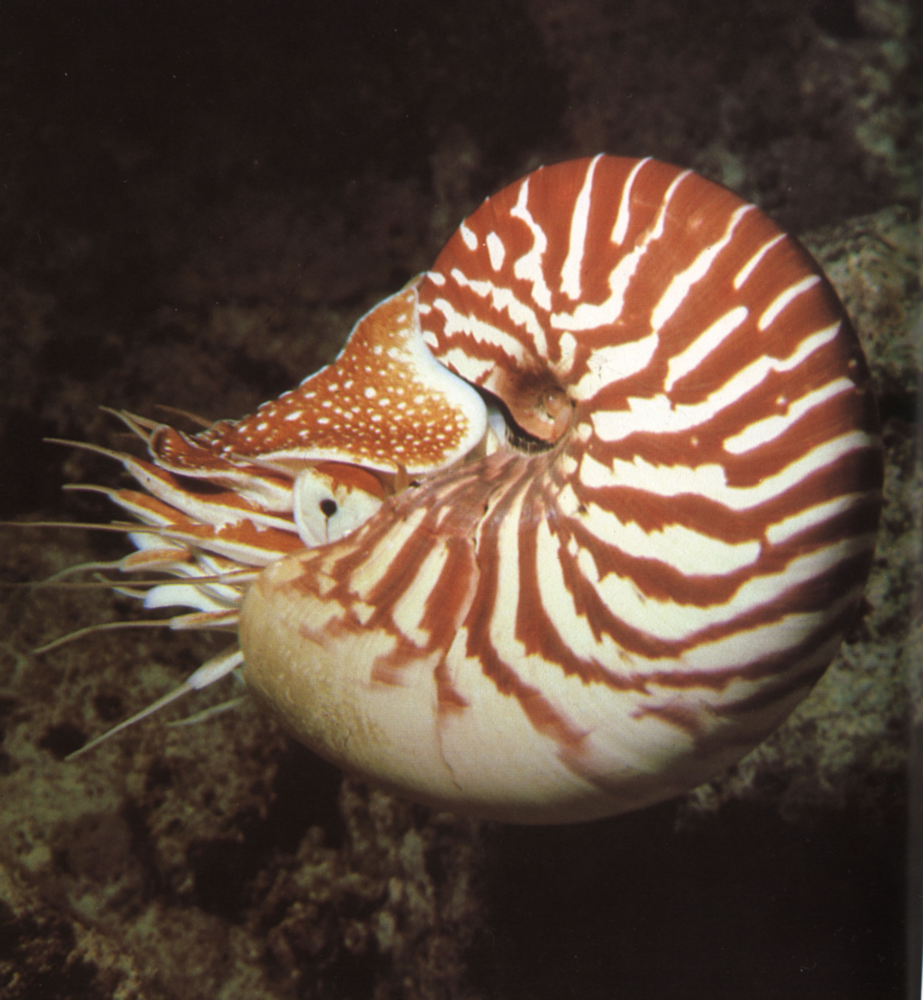

### Original Content

- Modern Nautilus

### 🎓 讲师讲解

> [AI: Explain Slide 12 - Please analyze the text and visuals above to explain the key concepts of this slide.]

---

## Slide 13

### Original Content

- Nautiloid: mode of life
- Modern Nautilus is coiled and nektonic.
- Shell is made of aragonite.
- Can swim at up to 50cm/sec using a jet.
- Can position the jet to swim backwards or forwards.

### 🎓 讲师讲解

> [AI: Explain Slide 13 - Please analyze the text and visuals above to explain the key concepts of this slide.]

---

## Slide 14

### Original Content

- Segment 2
- Fossil Cephalopods

### 🎓 讲师讲解

> [AI: Explain Slide 14 - Please analyze the text and visuals above to explain the key concepts of this slide.]

---

## Slide 15

### Visuals

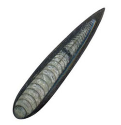

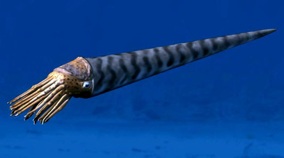

### Original Content

- Fossil Orthocone Nautiloids adopted a range of shell shapes
- Cameroceras is reported to have achieved lengths of 10m!!!!!!!
- This makes it the biggest predator of its day (Ordovician to Silurian).
- Note the genus name is something of a wastebasket term.

### 🎓 讲师讲解

> [AI: Explain Slide 15 - Please analyze the text and visuals above to explain the key concepts of this slide.]

---

## Slide 16

### Visuals

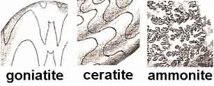

### Original Content

- Subclass Ammonoidea: (400—65.0 MA)
- Sutures
- Orders
- Goniatite                         Ceratite                           Ammonite

### 🎓 讲师讲解

> [AI: Explain Slide 16 - Please analyze the text and visuals above to explain the key concepts of this slide.]

---

## Slide 17

### Visuals

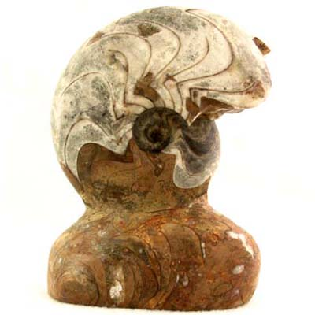

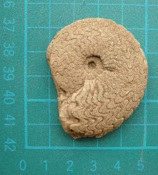

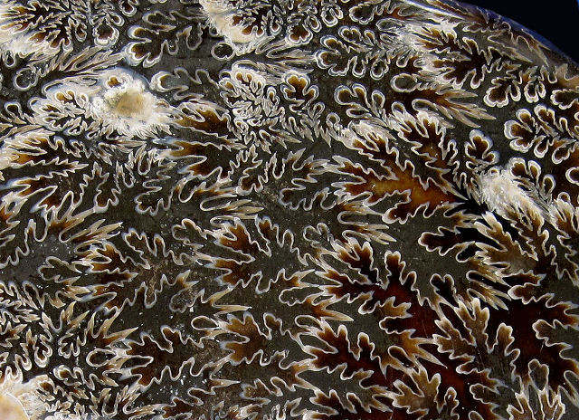

### Original Content

- Subclass Ammonoidea: (479.0—65.0 Ma)Sutures
- Sutures
- Orders
- Goniatite                         Ceratite                           Ammonite

### 🎓 讲师讲解

> [AI: Explain Slide 17 - Please analyze the text and visuals above to explain the key concepts of this slide.]

---

## Slide 18

### Visuals

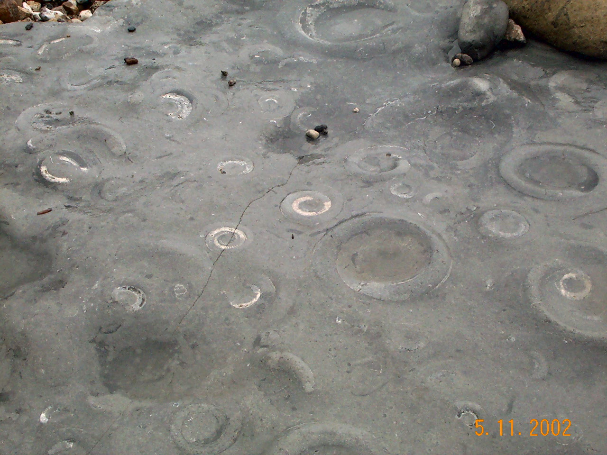

### Original Content

- Ammonites

### 🎓 讲师讲解

> [AI: Explain Slide 18 - Please analyze the text and visuals above to explain the key concepts of this slide.]

---

## Slide 19

### Original Content

- Fossil Cephalopod Shells
- Ammonite shells were made of ARAGONITE
- Ammonite shells were “largely” ectochliate (encapsulate the soft-tissue)
- Belemnite shells were made of  LOW MAGNESIAN CALCITE (LMC)
- Belemnites were endochliate (inside the soft tissue)

### 🎓 讲师讲解

> [AI: Explain Slide 19 - Please analyze the text and visuals above to explain the key concepts of this slide.]

---

## Slide 20

### Visuals

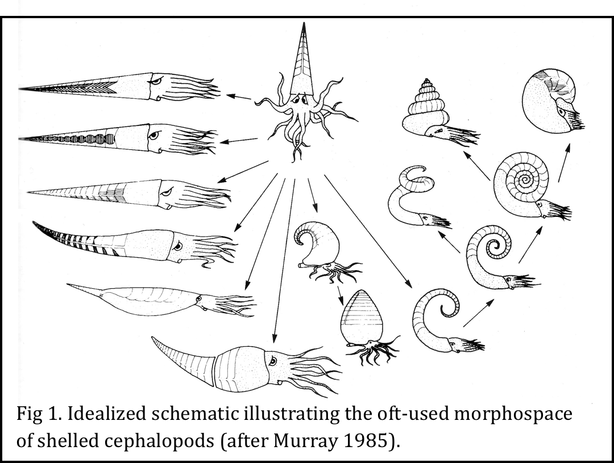

### Original Content

- Shelled Cephalopod Morphospace

### 🎓 讲师讲解

> [AI: Explain Slide 20 - Please analyze the text and visuals above to explain the key concepts of this slide.]

---

## Slide 21

### Visuals

### Original Content

- Order Ammonitida

### 🎓 讲师讲解

> [AI: Explain Slide 21 - Please analyze the text and visuals above to explain the key concepts of this slide.]

---

## Slide 22

### Visuals

### Original Content

- Order Ammonitida

### 🎓 讲师讲解

> [AI: Explain Slide 22 - Please analyze the text and visuals above to explain the key concepts of this slide.]

---

## Slide 23

### Visuals

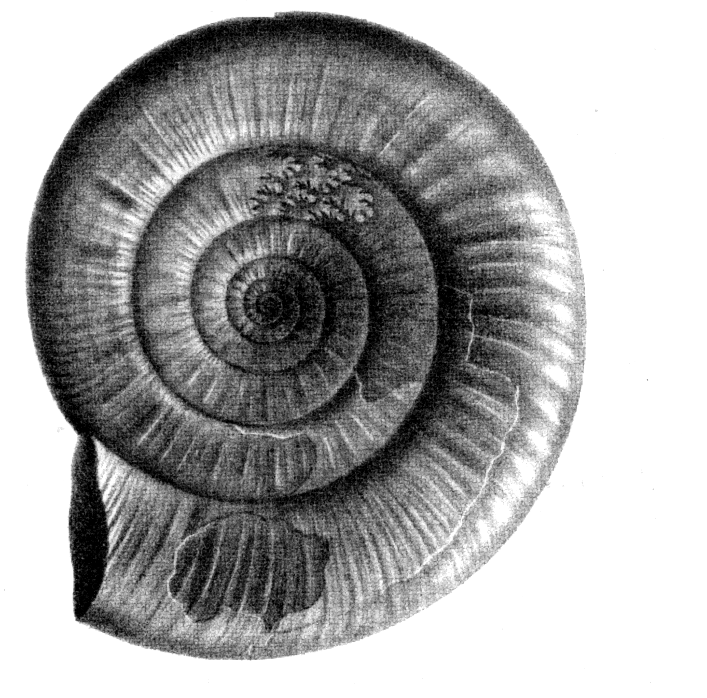

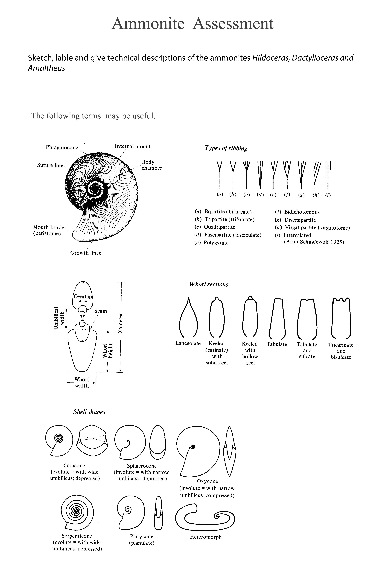

### Original Content

- Coilingevolute                   involute

### 🎓 讲师讲解

> [AI: Explain Slide 23 - Please analyze the text and visuals above to explain the key concepts of this slide.]

---

## Slide 24

### Visuals

### Original Content

- Parapuzosia seppenradensisThe largest ammonite ever found over 1.8m in diameter

### 🎓 讲师讲解

> [AI: Explain Slide 24 - Please analyze the text and visuals above to explain the key concepts of this slide.]

---

## Slide 25

### Original Content

- Cope’s Rule
- Cope’s Rule is the tendency for organisms in evolving
- lineages to increase in size over time.
- What benefits might this confer?
- What it a rule for all lineages or a “tendency” for some?
- Look at the data in question 2 of the practical!

### 🎓 讲师讲解

> [AI: Explain Slide 25 - Please analyze the text and visuals above to explain the key concepts of this slide.]

---

## Slide 26

### Visuals

### Original Content

- Ammonoid Shell Form

### 🎓 讲师讲解

> [AI: Explain Slide 26 - Please analyze the text and visuals above to explain the key concepts of this slide.]

---

## Slide 27

### Original Content

- Ammonites Hydrodynamics

### 🎓 讲师讲解

> [AI: Explain Slide 27 - Please analyze the text and visuals above to explain the key concepts of this slide.]

---

## Slide 28

### Visuals

### Original Content

- Hydrodynamics?evolute                   involute

### 🎓 讲师讲解

> [AI: Explain Slide 28 - Please analyze the text and visuals above to explain the key concepts of this slide.]

---

## Slide 29

### Original Content

- Ammonites: mode of life
- Modern Nautilus is nektonic.
- What is the evidence for mode of life in ammonites?

### 🎓 讲师讲解

> [AI: Explain Slide 29 - Please analyze the text and visuals above to explain the key concepts of this slide.]

---

## Slide 30

### Visuals

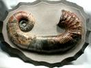

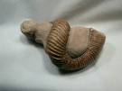

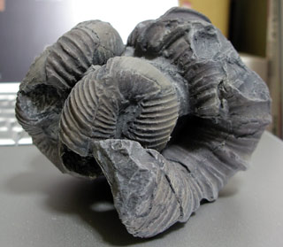

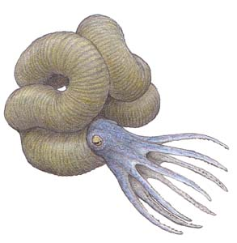

### Original Content

- Ammonites Heteromorphs

### 🎓 讲师讲解

> [AI: Explain Slide 30 - Please analyze the text and visuals above to explain the key concepts of this slide.]

---

## Slide 31

### Visuals

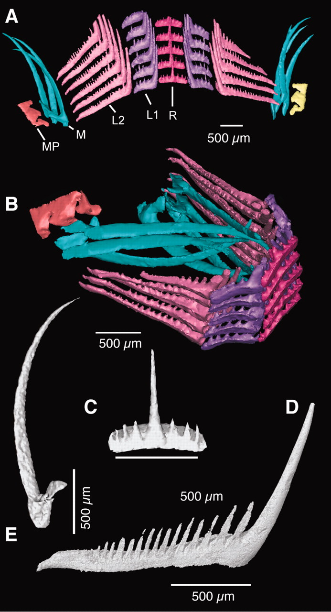

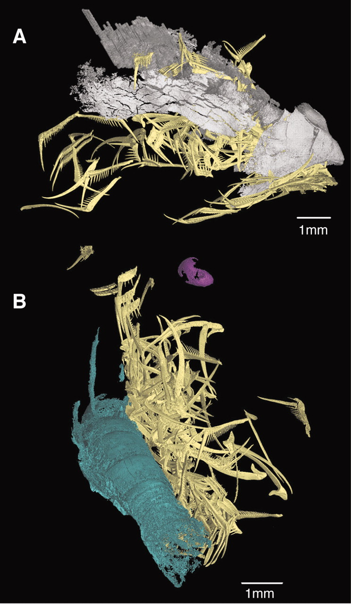

### Original Content

- Fig. 2 Morphology of the radula and teeth in Baculites sp.
- Kruta et al. Science 2011;331:70-72
- Published by AAAS

### 🎓 讲师讲解

> [AI: Explain Slide 31 - Please analyze the text and visuals above to explain the key concepts of this slide.]

---

## Slide 32

### Original Content

- Ammonites in the food chain

### 🎓 讲师讲解

> [AI: Explain Slide 32 - Please analyze the text and visuals above to explain the key concepts of this slide.]

---

## Slide 33

### Original Content

- Ammonites-Zone fossils
- Ammonites are zone-fossils par exellence
- Ammonite zones in the Jurassic are = to 1 million years
- Ammonite sub zones are equal to less than 80,000 years

### 🎓 讲师讲解

> [AI: Explain Slide 33 - Please analyze the text and visuals above to explain the key concepts of this slide.]

---

## Slide 34

### Visuals

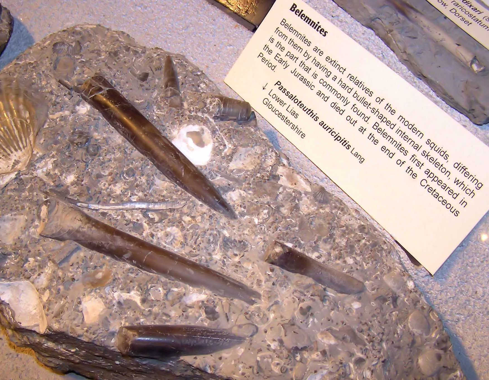

### Original Content

- Belemnites

### 🎓 讲师讲解

> [AI: Explain Slide 34 - Please analyze the text and visuals above to explain the key concepts of this slide.]

---

## Slide 35

### Visuals

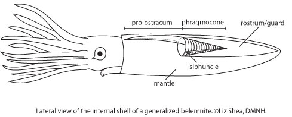

### Original Content

- Belemnites

### 🎓 讲师讲解

> [AI: Explain Slide 35 - Please analyze the text and visuals above to explain the key concepts of this slide.]

---

## Slide 36

### Original Content

- SEGMENT 3: Phylum Echinodermata
- Class Echinoidea
  - Regularia
  - Irregularia
- Class Crinoidea
- Class Holothuroidea
- Class Ophiuroidea
- Class Asteroidea

### 🎓 讲师讲解

> [AI: Explain Slide 36 - Please analyze the text and visuals above to explain the key concepts of this slide.]

---

## Slide 37

### Visuals

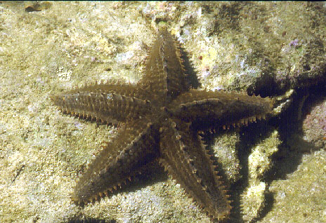

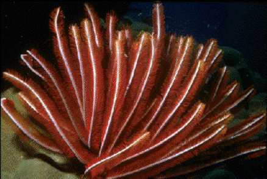

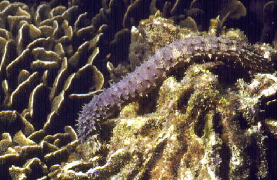

### Original Content

- Phylum:Echinodermata(spiny skins)

### 🎓 讲师讲解

> [AI: Explain Slide 37 - Please analyze the text and visuals above to explain the key concepts of this slide.]

---

## Slide 38

### Visuals

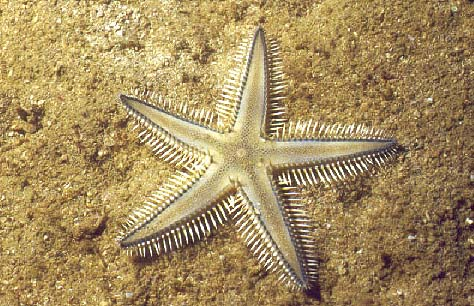

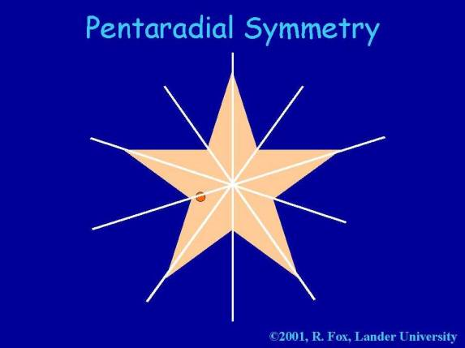

### Original Content

- Echinoderm characteristics
- Pentameral (5-fold) symmetry
- Not perfect as some features, mouth, anus, and madreporite can be non central
- Even where body is not pentaradial, elements of symmetry persist

### 🎓 讲师讲解

> [AI: Explain Slide 38 - Please analyze the text and visuals above to explain the key concepts of this slide.]

---

## Slide 39

### Visuals

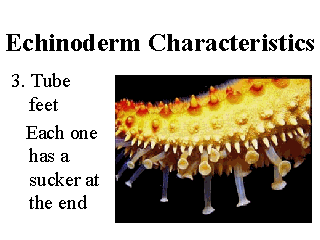

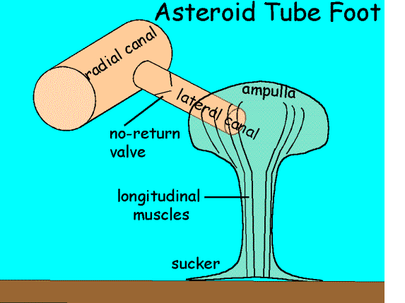

### Original Content

- Water-vascular system
- Tube feet used for movement and food acquisition and powered by hydraulic pressure

### 🎓 讲师讲解

> [AI: Explain Slide 39 - Please analyze the text and visuals above to explain the key concepts of this slide.]

---

## Slide 40

### Visuals

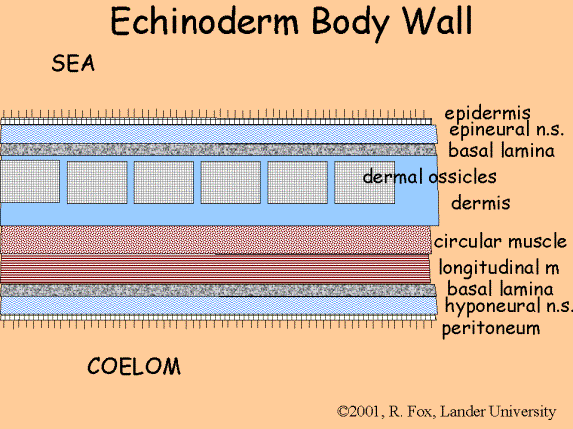

### Original Content

- Echinoderm:construction

### 🎓 讲师讲解

> [AI: Explain Slide 40 - Please analyze the text and visuals above to explain the key concepts of this slide.]

---

## Slide 41

### Visuals

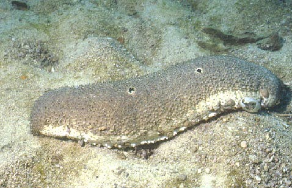

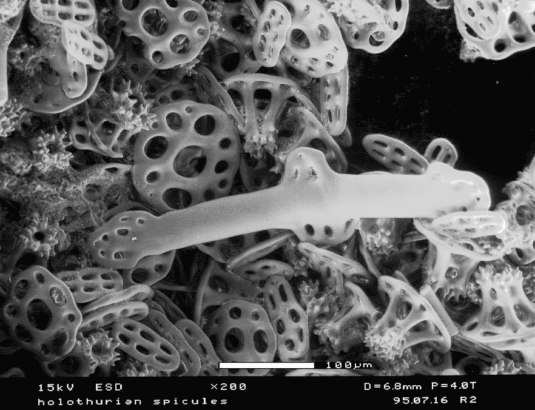

### Original Content

- Holothurians (Sea-cucumbers)

### 🎓 讲师讲解

> [AI: Explain Slide 41 - Please analyze the text and visuals above to explain the key concepts of this slide.]

---

## Slide 42

### Visuals

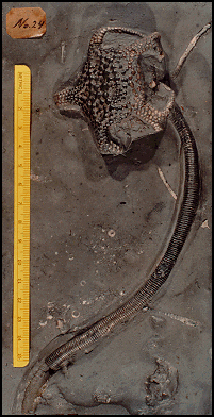

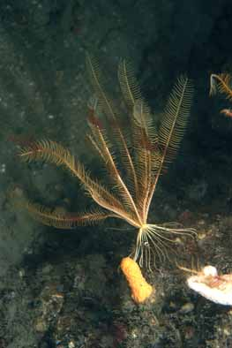

### Original Content

- Crinoidea

### 🎓 讲师讲解

> [AI: Explain Slide 42 - Please analyze the text and visuals above to explain the key concepts of this slide.]

---

## Slide 43

### Visuals

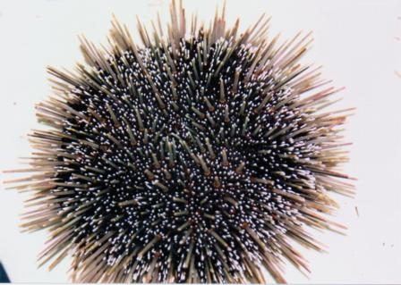

### Original Content

- Class:Echinoidea

### 🎓 讲师讲解

> [AI: Explain Slide 43 - Please analyze the text and visuals above to explain the key concepts of this slide.]

---

## Slide 44

### Visuals

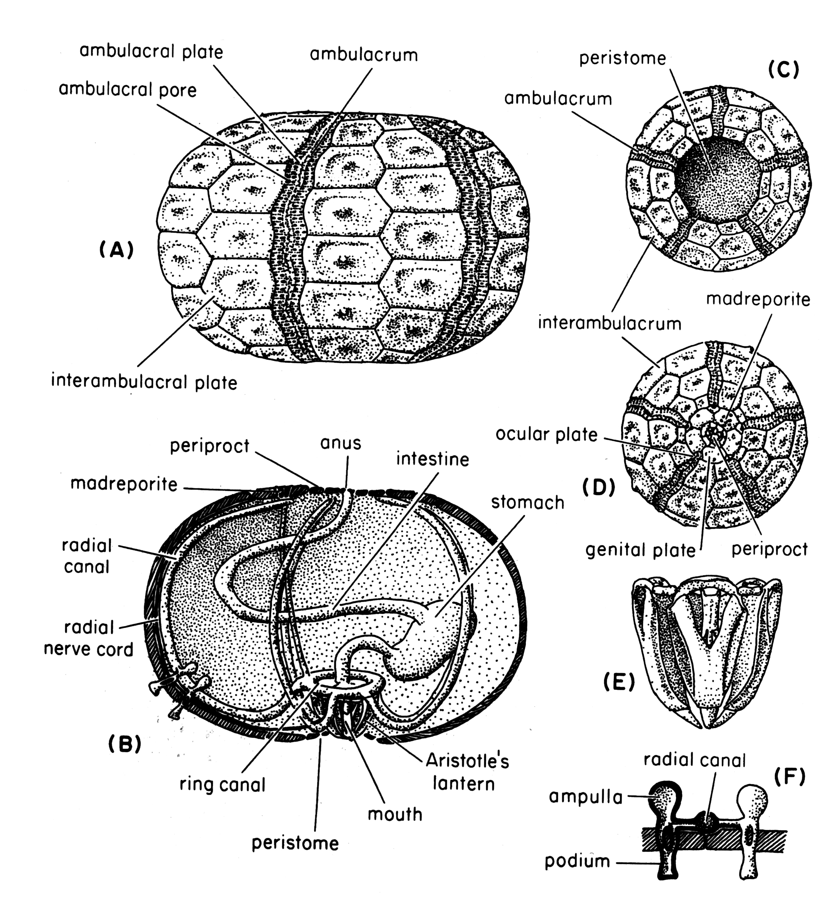

### Original Content

- Echinoid test morphology

### 🎓 讲师讲解

> [AI: Explain Slide 44 - Please analyze the text and visuals above to explain the key concepts of this slide.]

---

## Slide 45

### Visuals

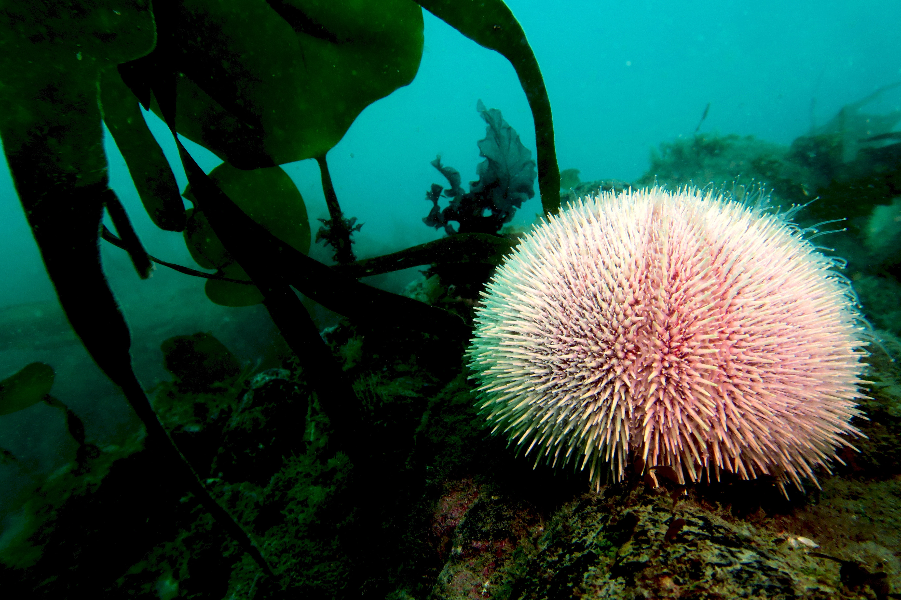

### Original Content

- Echinoid test morphology

### 🎓 讲师讲解

> [AI: Explain Slide 45 - Please analyze the text and visuals above to explain the key concepts of this slide.]

---

## Slide 46

### Visuals

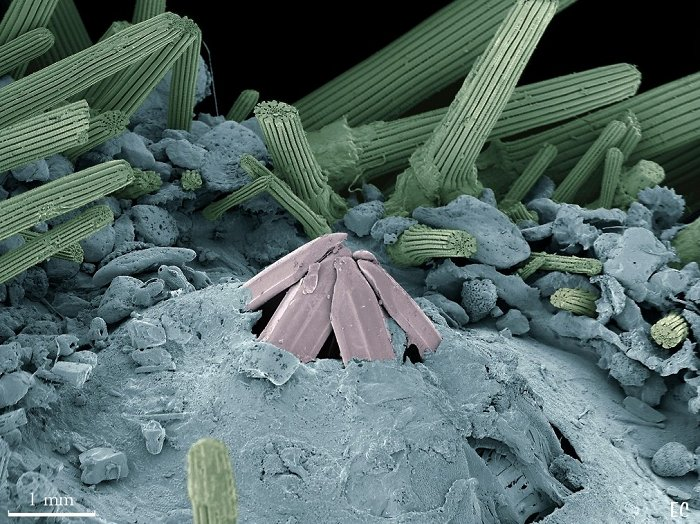

### Original Content

- Oral surface

### 🎓 讲师讲解

> [AI: Explain Slide 46 - Please analyze the text and visuals above to explain the key concepts of this slide.]

---

## Slide 47

### Visuals

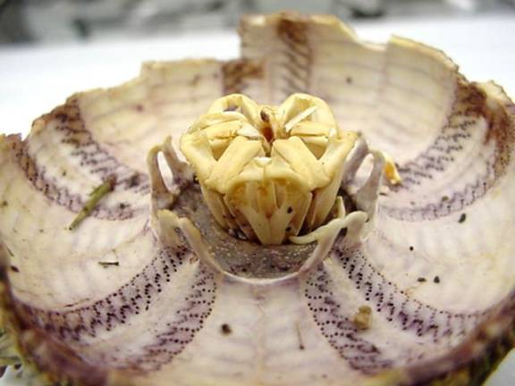

### Original Content

- Teeth (Aristotle’s lantern)

### 🎓 讲师讲解

> [AI: Explain Slide 47 - Please analyze the text and visuals above to explain the key concepts of this slide.]

---

## Slide 48

### Visuals

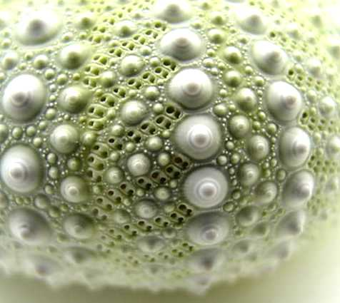

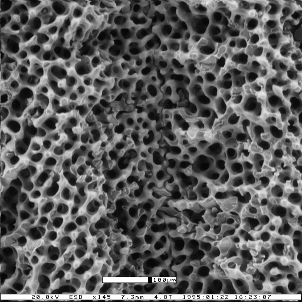

### Original Content

- Test construction (stereom)

### 🎓 讲师讲解

> [AI: Explain Slide 48 - Please analyze the text and visuals above to explain the key concepts of this slide.]

---

## Slide 49

### Visuals

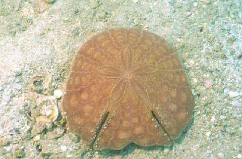

### Original Content

- Echinoid Symmetry

### 🎓 讲师讲解

> [AI: Explain Slide 49 - Please analyze the text and visuals above to explain the key concepts of this slide.]

---

## Slide 50

### Visuals

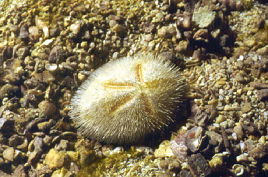

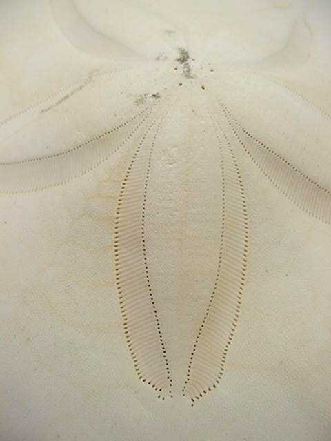

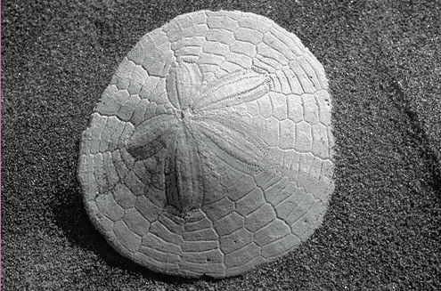

### Original Content

- Irregularia

### 🎓 讲师讲解

> [AI: Explain Slide 50 - Please analyze the text and visuals above to explain the key concepts of this slide.]

---

## Slide 51

### Visuals

### Original Content

*[No text detected]*

### 🎓 讲师讲解

> [AI: Explain Slide 51 - Please analyze the text and visuals above to explain the key concepts of this slide.]

